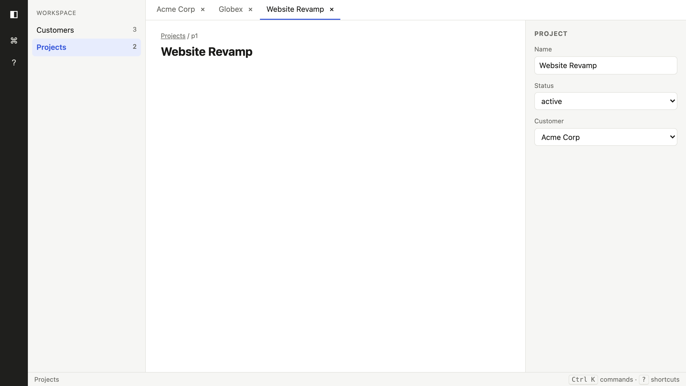
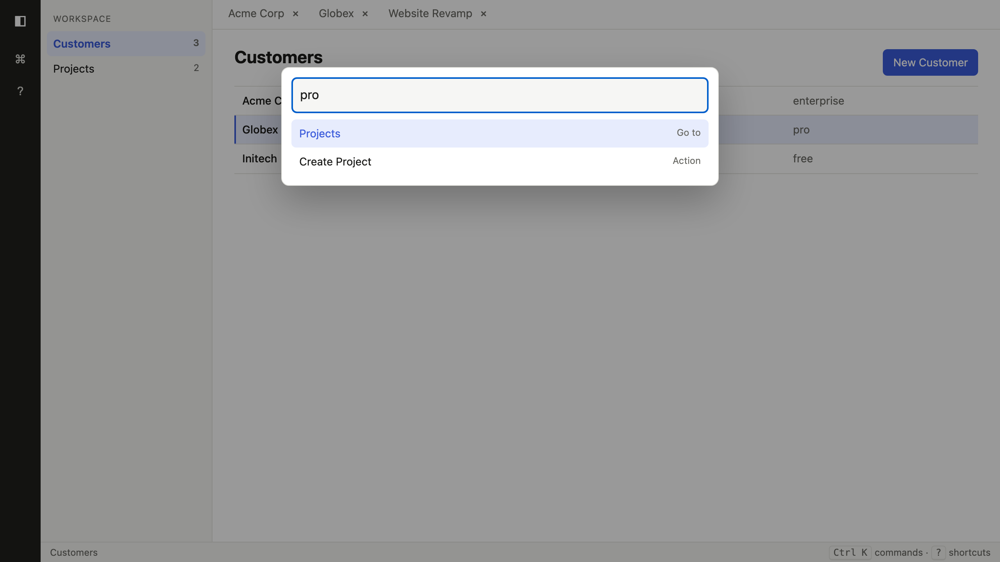

# One True Shell: Django

spec: 0.2

[](https://github.com/simkimsia/one-true-shell-django/actions/workflows/conformance.yml)

A Django implementation of [One True Shell](https://github.com/simkimsia/one-true-shell), the testable contract for the One True SaaS Layout.
It passes all 16 behaviors of the conformance suite at spec v0.2.0, and CI re-checks that on every push.



A record open in a tab. All six regions are visible, and the sidebar marks the active tab's entity (B14).



`Ctrl K` opens the palette over any page. Typing filters, and `Enter` runs the top match. The open tabs stay put while you browse lists (B13).

Python 3.12, Django 6.0.8, SQLite (bundled with Python), server-rendered templates, and one vanilla-JS file (`shell/static/shell/shell.js`, no build step) for shortcuts, the palette, tabs, and optimistic writes.

- Entities are read from `schema/entities.yaml` at runtime. There is one generic `Record` model (`entity`, `rid`, JSON `data`), so new entities need no migration.
- `POST /api/<entity>` creates (the client picks the id, so the row can render before the server answers). `POST /api/<entity>/<id>` updates. Both validate against the schema.
- Tabs live in `localStorage`. Keys pressed while a page is still loading are replayed on the next page.

## Run

```sh
./run.sh            # resets data to schema/seed.json, serves on ${PORT:-8000}
```

Needs Python 3.12+ (Django 6.0 requires it). Set `DJANGO_SECRET_KEY`, `DJANGO_ALLOWED_HOSTS` and `DJANGO_DEBUG` for anything beyond local use; `run.sh` uses Django's dev server.

## Versions

**This implementation targets One True Shell spec v0.2.**
Its own version is separate: it is at 0.1.0 and moves on its own schedule.

Both, plus the versions of the running stack, are readable at runtime, the way [toons](https://github.com/alesanfra/toons) exposes `__toon_spec__` next to `__version__`:

```python
import shell

shell.__shell_spec__   # "0.2"    spec version
shell.__version__      # "0.1.0"  implementation version
```

```sh
$ python manage.py shell_version
one-true-shell-django 0.1.0
spec 0.2
python 3.12.2
django 6.0.8
sqlite 3.46.0
pyyaml 6.0.3

$ curl -s localhost:8000/api/version
{"implementation": "one-true-shell-django", "version": "0.1.0", "spec": "0.2",
 "stack": {"python": "3.12.2", "django": "6.0.8", "sqlite": "3.46.0", "pyyaml": "6.0.3"}}
```

Every page also carries `<meta name="generator">` and `<meta name="one-true-shell-spec">`, and the status bar shows the spec version, linked to `/api/version`.
Stack versions are read from the running process, so they report what is actually installed (SQLite and Python vary by machine).
`shell/tests.py` asserts the spec version matches the workflow's `SPEC_REF` and the README, and that Django and PyYAML match `requirements.txt`, so a bump cannot pass unnoticed.

## Check conformance yourself

The suite lives in the contract repo, not here. Point it at this checkout:

```sh
git clone --branch v0.2.0 https://github.com/simkimsia/one-true-shell
cd one-true-shell/conformance && npm ci && npx playwright install chromium
IMPL_DIR=/path/to/one-true-shell-django npx playwright test
```

`schema/` is a copy of the contract's `schema/` at v0.2.0. The suite asserts on seed records, so a drifted copy fails the run.

This repo is also the worked example of an implementation living outside the contract repo: [`.github/workflows/conformance.yml`](.github/workflows/conformance.yml) is the whole recipe.

## License

MIT
